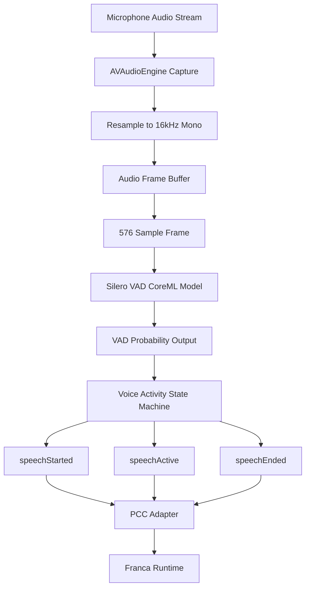

# PhysisVAD


[](https://swiftpackageindex.com)


[](https://nova.app)

A modular Swift package for local voice activity detection on Apple platforms.

## Current direction

- Local, on-device VAD
- CoreML-backed Silero VAD
- Platform-local detection only
- No STT ownership
- No runtime/session ownership

## Responsibilities

This package is responsible for:

- loading the VAD model
- accepting mono Float audio samples
- chunking audio into model-sized windows
- running inference
- smoothing activity state
- emitting normalized local speech events

This package is not responsible for:

- transcription
- websocket / networking
- turn semantics
- Orb / UI rendering
- PCC state management

## Expected model location

Place the model here:

`Sources/PhysisVAD/Models/silero-vad-unified-v6.0.0.mlpackage`

## Public surface

- `VADProcessor`
- `VADConfiguration`
- `VoiceActivityEvent`
- `VoiceActivityState`

## Architecture


	
### How it works
	
	1. Audio is captured from the device microphone.
	2. The stream is resampled to **16kHz mono** for the VAD model.
	3. Audio samples are buffered and segmented into **576-sample frames** (~36ms).
	4. Each frame is processed by the **Silero VAD CoreML model**.
	5. The model outputs a **speech probability (0–1)**.
	6. A state machine applies smoothing and emits normalized events:
	
	- `speechStarted`
	- `speechActive`
	- `speechEnded`
	
	7. These events are forwarded to **PCC**, which integrates them into the Franca voice pipeline.

## Notes

The CoreML wrapper uses a generic `MLModel` loader rather than relying on a generated typed class.
This keeps the package cleaner and more portable inside SwiftPM.

---

## Model Credits

This package uses the **Silero Voice Activity Detection (VAD)** model, converted to **CoreML** for Apple platforms.

### Original model
- **Silero Team**
- Repository: `https://github.com/snakers4/silero-vad`

### CoreML conversion
- **FluidInference**
- Model card: `https://huggingface.co/FluidInference/silero-vad-coreml`

### License
- **MIT**  
  Both the original Silero model and the CoreML conversion are listed as MIT-licensed.

---

## Model Notes

The bundled model is a **CoreML implementation of Silero VAD** optimized for Apple platforms, intended for:

- real-time voice activity detection in iOS/macOS applications
- speech preprocessing for ASR systems
- audio segmentation and filtering

This package currently uses the standard streaming model variant:

- `silero-vad-unified-v6.0.0.mlpackage`

---

## Performance Notes

According to the original CoreML model card:

- the project includes performance comparison charts against the Silero VAD v6.0.0 baseline
- the **256ms** variant processes **8 chunks of 32ms audio in batches**, making it significantly faster than the standard streaming variant
- the maintainers note that **quantized versions did not provide performance improvement**, since the model is already very small

For exact benchmark visuals and comparison graphs, see the original model card:

`https://huggingface.co/FluidInference/silero-vad-coreml/blob/main/README.md`

---

## Attribution

If you use or extend this package, please credit both:

- the **Silero Team** for the original VAD model
- **FluidInference** for the CoreML conversion work

Suggested citations from the original model card:

```bibtex
@misc{silero-vad-coreml,
  title={CoreML Silero VAD},
  author={FluidAudio Team},
  year={2024},
  url={https://huggingface.co/alexwengg/coreml-silero-vad}
}

@misc{silero-vad,
  title={Silero VAD},
  author={Silero Team},
  year={2021},
  url={https://github.com/snakers4/silero-vad}
}
```
