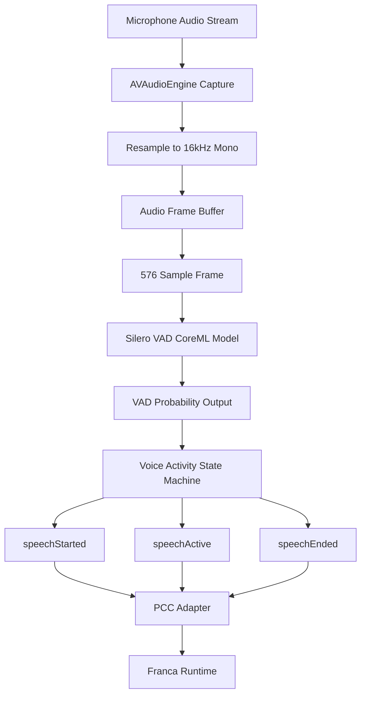

# PhysisVAD


[](https://swiftpackageindex.com)


[](https://nova.app)

A modular Swift package for local voice activity detection on Apple platforms.

## Current direction

- Local, on-device VAD
- CoreML-backed Silero VAD
- Platform-local detection only
- No STT ownership
- No runtime/session ownership

## Responsibilities

This package is responsible for:

- loading the VAD model
- accepting mono Float audio samples
- chunking audio into model-sized windows
- running inference
- smoothing activity state
- emitting normalized local speech events

This package is not responsible for:

- transcription
- websocket / networking
- turn semantics
- Orb / UI rendering
- PCC state management

## Expected model location

Place the model here:

`Sources/PhysisVAD/Models/silero-vad-unified-v6.0.0.mlpackage`

## Public surface

- `VADProcessor`
- `VADConfiguration`
- `VoiceActivityEvent`
- `VoiceActivityState`

## Architecture


	
### How it works
	
	1. Audio is captured from the device microphone.
	2. The stream is resampled to **16kHz mono** for the VAD model.
	3. Audio samples are buffered and segmented into **576-sample frames** (~36ms).
	4. Each frame is processed by the **Silero VAD CoreML model**.
	5. The model outputs a **speech probability (0–1)**.
	6. A state machine applies smoothing and emits normalized events:
	
	- `speechStarted`
	- `speechActive`
	- `speechEnded`
	
	7. These events are forwarded to **PCC**, which integrates them into the Franca voice pipeline.

## Notes

The CoreML wrapper uses a generic `MLModel` loader rather than relying on a generated typed class.
This keeps the package cleaner and more portable inside SwiftPM.

---

## Roadmap

The current package provides a working, tested CoreML-backed Silero VAD implementation for Apple platforms. The following roadmap outlines the most valuable next improvements, ordered from highest impact to lower-priority refinements.

### 1. Replace the current frame buffer with a true ring buffer
The current buffering approach is functional, but a dedicated ring buffer would reduce unnecessary array churn and improve stability for continuous real-time use.

Planned improvements:
- fixed-capacity circular audio buffer
- lower allocation overhead during continuous streaming
- cleaner frame extraction under sustained capture loads
- better foundation for pre-roll support

### 2. Add pre-roll buffering
A short pre-roll buffer would preserve a small amount of audio immediately before speech activation so the first syllable is not clipped when upstream streaming begins.

Planned improvements:
- retain ~200–300 ms of recent audio history
- expose pre-roll audio when `speechStarted` fires
- improve real-world streaming responsiveness
- reduce clipped utterance starts in interactive voice systems

### 3. Harden the voice activity state machine
The current state machine is intentionally simple. It should be expanded to better handle real-world noise, short utterances, and interruption scenarios.

Planned improvements:
- distinct start and end thresholds
- stricter barge-in gating than general speech detection
- minimum speech duration
- minimum silence duration
- optional cooldown after speech end
- improved debounce behavior in noisy environments

### 4. Expand test coverage
The package already has baseline tests, but broader coverage will improve reliability as the module is integrated into live audio systems.

Planned improvements:
- repeated silence / repeated speech tests
- start-debounce and end-hangover validation
- reset behavior validation
- recurrent state reset correctness
- invalid frame handling
- long-running stream stability tests

### 5. Add debug and telemetry hooks
Observability will make tuning and integration much easier when the package is connected to live microphone input.

Planned improvements:
- optional debug logging
- probability tracing
- event tracing
- frame counters
- inference timing metrics
- simple diagnostics mode for integration testing

### 6. Improve recurrent state/session lifecycle handling
The Silero model is stateful, so explicit control over model lifecycle will improve predictability across sessions and interruptions.

Planned improvements:
- clearer session start/end semantics
- optional automatic reset after long silence
- better interruption/reset hooks
- route-change safe reset behavior
- clearer guidance for host app integration

### 7. Optimize CoreML input/output memory handling
The current implementation is correct, but there is room to reduce allocations and improve efficiency around CoreML inference.

Planned improvements:
- reduce repeated temporary allocations
- reuse `MLMultiArray` buffers where practical
- tighten inference path memory behavior
- improve sustained runtime efficiency

### 8. Refine the public API surface
The public package API can be expanded to provide a more production-friendly interface while preserving a small core contract.

Planned improvements:
- clearer separation between raw model probability and semantic events
- richer event/result structures
- optional streaming-oriented APIs
- better debug-facing inspection interfaces

### 9. Add optional helper adapters for upstream audio normalization
The package currently expects correctly prepared input. Small helper utilities could make integration easier without taking ownership of full microphone capture.

Planned improvements:
- helper seams for 16kHz mono normalization
- stricter input contract documentation
- optional convenience adapters for Apple audio pipelines

### 10. Expand the event model where useful
The current event surface is intentionally minimal. Over time, additional event types may be useful for more advanced interaction systems.

Possible future additions:
- `bargeInCandidate`
- `speechProbabilityUpdated`
- `speechStateChanged`
- `stabilityReached`

These would be introduced carefully to avoid overcomplicating the package’s core purpose.

---

## Model Credits

This package uses the **Silero Voice Activity Detection (VAD)** model, converted to **CoreML** for Apple platforms.

### Original model
- **Silero Team**
- Repository: `https://github.com/snakers4/silero-vad`

### CoreML conversion
- **FluidInference**
- Model card: `https://huggingface.co/FluidInference/silero-vad-coreml`

### License
- **MIT**  
  Both the original Silero model and the CoreML conversion are listed as MIT-licensed.

---

## Model Notes

The bundled model is a **CoreML implementation of Silero VAD** optimized for Apple platforms, intended for:

- real-time voice activity detection in iOS/macOS applications
- speech preprocessing for ASR systems
- audio segmentation and filtering

This package currently uses the standard streaming model variant:

- `silero-vad-unified-v6.0.0.mlpackage`

---

## Performance Notes

According to the original CoreML model card:

- the project includes performance comparison charts against the Silero VAD v6.0.0 baseline
- the **256ms** variant processes **8 chunks of 32ms audio in batches**, making it significantly faster than the standard streaming variant
- the maintainers note that **quantized versions did not provide performance improvement**, since the model is already very small

For exact benchmark visuals and comparison graphs, see the original model card:

`https://huggingface.co/FluidInference/silero-vad-coreml/blob/main/README.md`

---

## Attribution

If you use or extend this package, please credit both:

- the **Silero Team** for the original VAD model
- **FluidInference** for the CoreML conversion work

Suggested citations from the original model card:

```bibtex
@misc{silero-vad-coreml,
  title={CoreML Silero VAD},
  author={FluidAudio Team},
  year={2024},
  url={https://huggingface.co/alexwengg/coreml-silero-vad}
}

@misc{silero-vad,
  title={Silero VAD},
  author={Silero Team},
  year={2021},
  url={https://github.com/snakers4/silero-vad}
}
```
